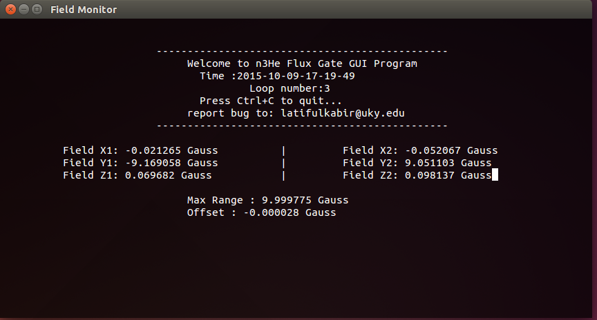

Linux driver for magnetometer
=============================

The n3He experiment uses flux gate(A magnetometer from Bartington, Model:Mag-03 DAM) to measure magnetic field at any point precisely. But the device did not come with any driver or support for Linux. This program is the driver for this flux gate so that a Linux machine can read magnetic field through serial communication, then display it on a ncurses window which gets updated periodically. 

