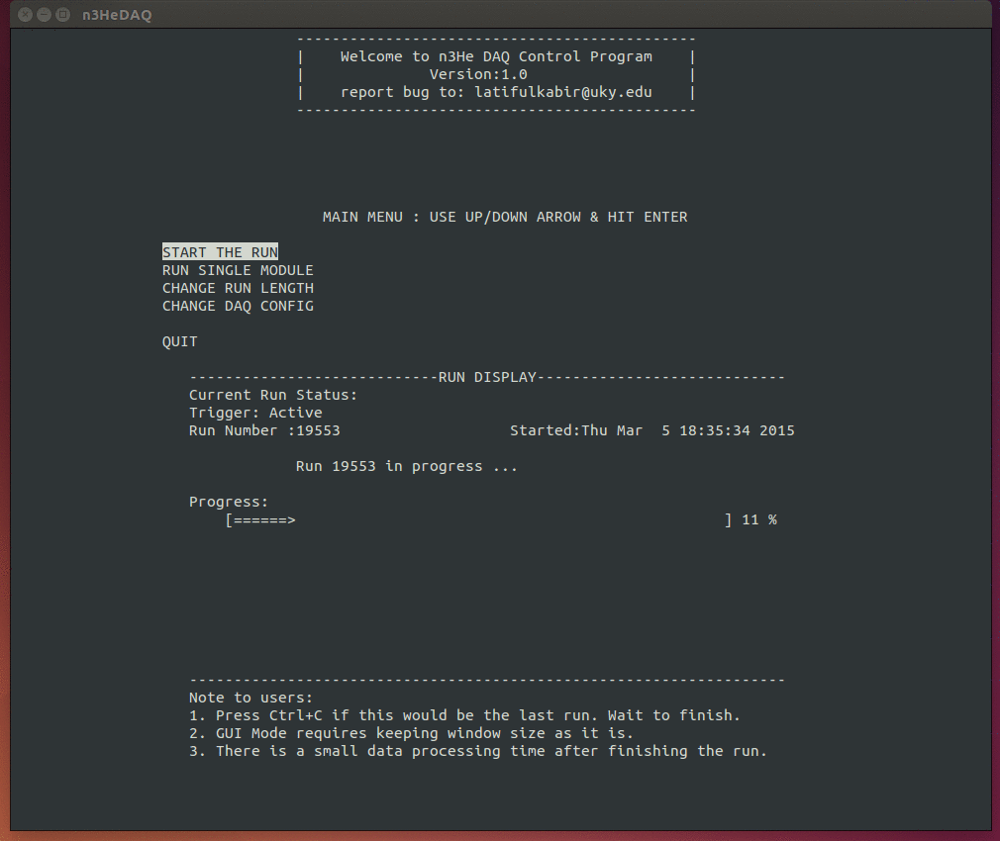

 n3He DAQ Control Program
===============================
The program is a curses based data acquisition system (DAQ) control GUI (which also include command line option) for the n3He experiment at Oak Ridge National Lab. The controller GUI talks to Unix based DAQ through TCP/IP connection and allows the user to take data in different modes and options in a user friendly environment. 

Instruction for the Users
==================================

The n3He DAQ control program has two independent interfaces --  GUI mode and command line mode.

GUI mode:
----------

Use the desktop shortcut (double click on it) to run the n3HeDAQ control program in GUI mode.

Or, alternatively from a terminal do:

* `n3he gui` :
    This will run n3he DAQ control program in gui mode. Note it is a Ncurses terminal based gui.

    

Command line mode:
--------------------

From the terminal do the following:
 
* `n3he start` :

  This will start the data taking process for all the DAQ modules for the default run length continuously.

* `n3he start LENGTH RUN`: 

   Where, LENGTH = The length of each run in Megabyte, RUN = the number of runs to be taken.
   
   Note RUN and LENGTH must be integer.
   
   This will take only 'RUN' number of runs of length 'LENGTH' Megabyte each for all the DAQ modules.

* `n3he daq MODULE`:

    Where, MODULE= The DAQ module you want to run. It acn be either 21,22,23,24,30.
    
    This will take data only for the DAQ module number 'MODULE' in continuous mode for the default run length.
    
    If the module number is not specified it will take data only for module 21 by default.       

* `n3he daq MODULE LENGTH RUN`:

    Where, MODULE= The DAQ module you want to run. It acn be either 21,22,23,24,30.
    
     LENGTH = The length of each run in Megabyte, RUN= the number of runs to be taken. 
           
    This will take data only for the DAQ module number 'MODULE' for 'RUN' number of runs of length 'LENGTH' each.
    
    If MODULE, RUN and LENGTH are not specified the default values are, MODULE=21, RUN=continuous runs and LENGTH =default run length.       

* `n3he config `:

    This will display the current configuration (Sample rate,Averaging, Hi Resolution mode etc.) for all the DAQ module.
    This option is yet to be implemented.

* `n3he help` :
 
   This will bring this help session. 

To quit the program while in continuous data taking mode :

- Press Ctrl+C any time, The DAQ program will finish the current run first, then it will quit.

A typical GUI mode preview:
-----------------------------

A typical run with command "n3he start" will look as follows:
--------------------------------------------------------------

        Welcome to n3He DAQ Control Program v1.0  
           report bug to: latifulkabir@uky.edu
  
--------Initializing Run number: 88 on Aug 17 2014 at 00:30:45------------

Run 88 in progress ... ... 

`[==================================================] 100% `

datafile-21 has been renamed to run88data_file-21

datafile-22 has been renamed to run88data_file-22

datafile-23 has been renamed to run88data_file-23

datafile-30 has been renamed to run88data_file-30

Phew!!! Done with run number : 88

Instruction for the Developers
=================================

n3He DAQ Control Program  Version: 1.0
---------------------------------------

 0. The src directory includes three separate sub-directories "core, gui, lib" where the corresponding source codes will be placed gradually.
The makefile is configured to put the corresponding object files in newly created corresponding directory (named core,gui,lib) inside "obj" while compiling. The "core" directory contains all core sources for running from the terminal(command line) mode.

 1. From n3HeDAQ directory just do: `make`

 2. The source code uses some c++11 features requiring your compiler to be c++11 supported.

 3. The GUI requires Ncurses. If you are trying to compile on your computer make sure you have Ncurses installed.

 4. The core sources are mostly using c++ syntax, but the Ncurses GUI uses C. So caution is required to make sure you are using correct 
    compiler.

 4. The command line mode and GUI mode codes are completely separate, works independently. This is done to keep command line version 
    as clean as possible suitable for quick changes.

 5. To remove the object files but keeping the binary do: `make clean`

 6. The binary file (named 'n3he') will be produced inside */n3He/n3HeDAQ/bin

 
 5. Testing the program:
-------------------------------
The DAQ to control computer data transfer situation can be mocked up on you own lapton easily in the following way:
 * Choose a big enough (say 500 MB) file on your computer to be transferred via localhost.
 * From the terminal do: `nc -l 1234 < to_be_sent_filename`
   This will be streaming that file to the port 1234 via localhost (IP: 127.0.0.1) to be read by client Socket.
 * Change the n3HeDAQ source for appropriate IP and Port (here 127.0.0.1 and 1234) and do `make`
 * running `n3he` will make an exact copy of the file sent.
 * This procedure can be replicated to mock up more thn one DAQ running simultaneously. 

 * If you enable cout.write() (L67 in Socket.cpp) , then if you do :` n3he start | pv > filename`, then it will also show the data transfer rate.

										Last Updated on 1/12/15
                                                                                 -Latiful Kabir

