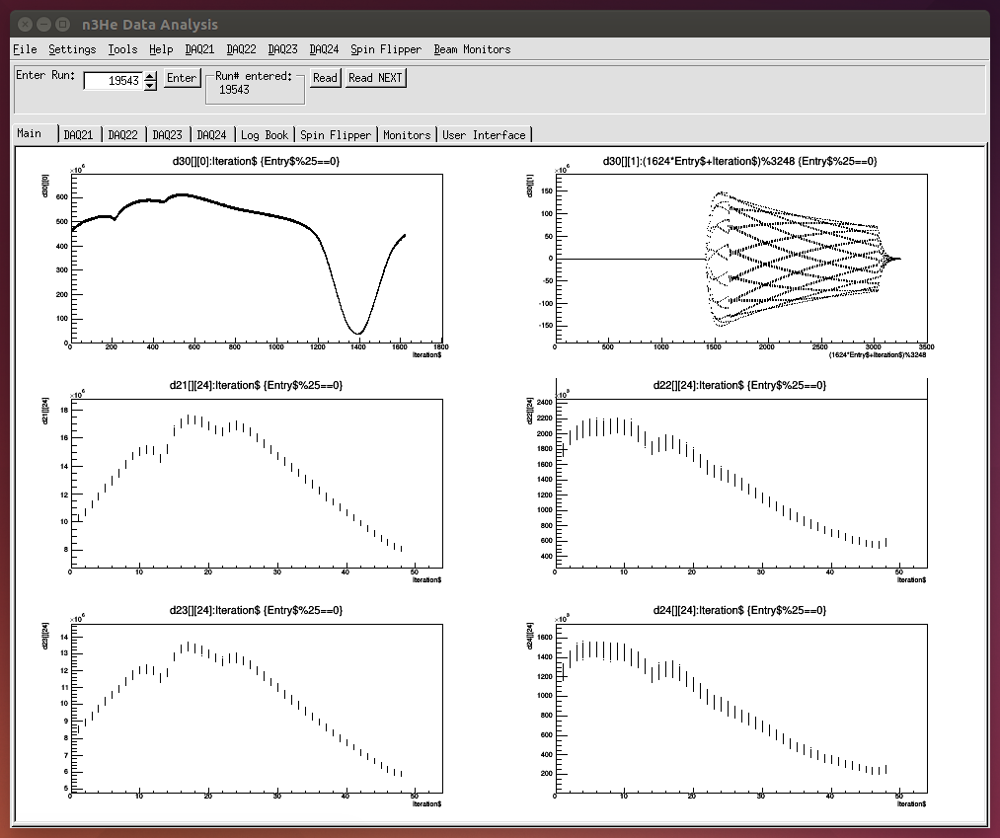

      ======================================================================================================
                                    Data Browser for the n3He Experiment
      ======================================================================================================
1. bin directory: contains just binary files(obtained after doing make) named n3HeData.

2. libn3He directory: Contains all the library required for running the Data check GUI.

3. Modify and compile the library:
   You need to change the Data file directory from Constants.h in libn3He to appropriate directory. Before you do 'make' do: "make clean"   
   in the same directory.  and then make a fresh shared binary files after you make any changes.

4. Place .so file under LD_LIBRARY_PATH:
   Now make sure the shared library (libn3He.so) file is in a directory under your LD_LIBRARY_PATH. 

   OR, a more professional way is as follows:
   Open */libn3He/bin/thisn3He.sh and define "n3HeROOT" path variable to the location where "libn3He" is located.
   for example: n3HeROOT=/home/siplu/libn3He/
   
   Now include command in your .bashrc file to run thisn3He.sh file each time you open the terminal. i.e. include the fillowing lines:

```
if [ -f path_to/libn3He/bin/thisn3He.sh ]; then
	. path_to/libn3He/bin/thisn3He.sh
fi
```

5. Produce binary for GUI:
  To produce a new binary file named "n3HeData", go to n3HeData directory, open makefile and change LIB_INCLUDE and GLIBS to
  appropriate location for you and then do "make". It will produce "n3HeData" binary file in the same dirctory. 

6. Run the GUI:
   Now run the binary file"n3HeData" by doing "./n3HeData" from your recently compiled verson in */n3He_DAQ_GUI/n3HeData/ .

7. Modify the .desktop file and .sh file in bin directory accordingly and place it in your desktop if you want to run the GUI just by double clicking from your desktop.

8. Screenshot:



Note: This version works both for ROOT 5 and ROOT 6.


                                                                                  Last Updated on 1/15/15
                                                                                 -Latiful Kabir
