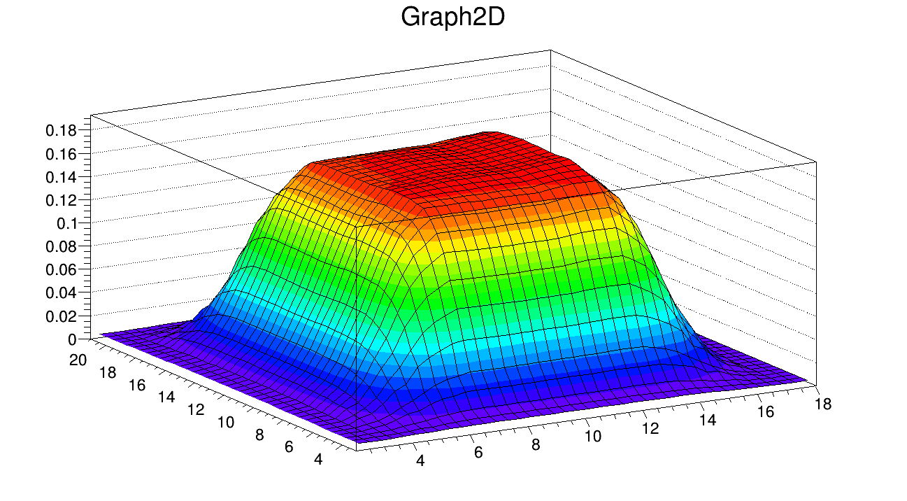

Analysis of Beam Scan Data
===============================

The XYZ robot was used for neutron beam scan in restricted highly radioactive area for the n3He experiment at Oak Ridge National Lab. The collected data was then analyzed using ROOT data analysis framework to calculate the neutron beam centroid. The image shows the graph produced in the beam scan analysis to calculate beam centroid.

